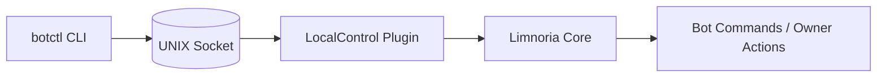

<!-- LocalControl provides a UNIX socket for local command execution. -->

## LocalControl 

[](https://github.com/Alcheri/LocalControl/releases/latest)
[](https://github.com/Alcheri/LocalControl/actions/workflows/tests.yml)
[](https://github.com/Alcheri/LocalControl/actions/workflows/lint.yml)
[](https://github.com/Alcheri/LocalControl/security/code-scanning)


LocalControl is a minimal UNIX-socket control interface for Limnoria bots. It
provides a local administrative command channel without exposing a separate
remote control interface over IRC.

This project includes:

- A Limnoria plugin (`LocalControl`)
- A generic command‑line client (`botctl`)
- Optional wrapper scripts for multi‑bot setups

LocalControl is designed to be self-contained, predictable, and portable across
multiple bot instances.

The socket is intended as a local owner-control channel. Local filesystem access
to `.localcontrol.sock` is therefore equivalent to owner-level bot access.
The optional TCP listener has the same owner-level control semantics and is
disabled by default.

---

## Installation

Clone the repository into your Limnoria plugin directory, usually
`~/runbot/plugins`:

```bash
cd ~/runbot/plugins
git clone https://github.com/Alcheri/LocalControl.git
```

Load the plugin into your bot:

```text
/msg yourbot load LocalControl
```

The plugin creates this UNIX domain socket beside `plugin.py`:

```text
~/runbot/plugins/LocalControl/.localcontrol.sock
```

LocalControl restricts the socket file to owner-only permissions (`0600`) after
binding it. The parent directory must still be protected so that only trusted
local users can reach the socket path.

If you install the plugin somewhere else, adjust the examples below to match
that path.

---

## Required Hostmask Setup

LocalControl generates a synthetic IRC-style prefix for each local request, for
example:

```text
LocalControl123!local123@localcontrol.invalid
```

To allow this synthetic user to execute owner-level commands, you **must** add a
matching hostmask to your Limnoria user account.

In your Limnoria console (or via IRC as the bot owner):

```text
/msg <bot> user hostmask add <your-account> LocalControl*!local*@localcontrol.invalid
```

Without this step, the bot will reject requests from `botctl` because they will
not map to an authorized owner identity.

---

## CLI Usage

The `botctl` script communicates with the LocalControl socket.

It is located in the plugin directory:

```text
~/runbot/plugins/LocalControl
```

Make it executable if needed:

```bash
chmod +x ~/runbot/plugins/LocalControl/botctl
```

You can then run it directly or add that directory to your `PATH`.

Basic usage:

```bash
botctl bot sysinfo
botctl bot say '#channel' Hello from LocalControl
botctl bot config <name> [<value>]
botctl exec "reload LocalControl"
```

`exec` sends a raw command line. `bot` accepts command tokens directly, which
makes it convenient for bot commands such as `sysinfo` or `say`.

### Architecture Overview

The LocalControl request flow:



### Socket configuration

The CLI resolves the socket path in this order:

1. `--socket` command‑line flag
2. `BOT_CONTROL_SOCKET` environment variable
3. Default path:

```text
~/runbot/plugins/LocalControl/.localcontrol.sock
```

Example:

```bash
botctl --socket /tmp/test.sock bot sysinfo
```

### Optional TCP listener

LocalControl can also expose the same line-based command protocol on TCP for
local testing tools. This listener is disabled by default:

```bash
botctl bot config plugins.LocalControl.tcpListenerEnabled
```

The default TCP endpoint is loopback-only:

```text
127.0.0.1:8023
```

Enable it for local testing:

```bash
botctl bot config plugins.LocalControl.tcpListenHost 127.0.0.1
botctl bot config plugins.LocalControl.tcpListenPort 8023
botctl bot config plugins.LocalControl.tcpListenerEnabled true
botctl exec "reload LocalControl"
```

The listener is created when the plugin starts, so reload LocalControl after
changing `tcpListenerEnabled`, `tcpListenHost`, or `tcpListenPort`.

Binding to a non-loopback address is blocked unless
`plugins.LocalControl.tcpAllowRemote` is set to `true`. Do not enable remote TCP
binding unless the host firewall and network exposure are deliberately
controlled. Anyone who can connect can issue owner-level bot commands.

---

## Troubleshooting

### `botctl` is rejected or reports that you are not authorized

This usually means the synthetic LocalControl identity is not mapped to your
owner account.

Verify that your Limnoria account has this hostmask:

```text
LocalControl*!local*@localcontrol.invalid
```

If needed, add it again:

```text
/msg <bot> user hostmask add <your-account> LocalControl*!local*@localcontrol.invalid
```

### `botctl` cannot connect to the socket

Check that the plugin is loaded and that the socket file exists at the expected
path:

```text
~/runbot/plugins/LocalControl/.localcontrol.sock
```

If your installation uses a different location, pass it explicitly:

```bash
botctl --socket /path/to/.localcontrol.sock bot sysinfo
```

You can also set it once with an environment variable:

```bash
export BOT_CONTROL_SOCKET=/path/to/.localcontrol.sock
```

If the socket file is missing entirely, reload the plugin and check the bot log
for bind or startup errors.

### TCP listener does not accept connections

Check the configured host, port, and enable flag:

```bash
botctl bot config plugins.LocalControl.tcpListenerEnabled
botctl bot config plugins.LocalControl.tcpListenHost
botctl bot config plugins.LocalControl.tcpListenPort
```

After changing those values, reload the plugin:

```bash
botctl exec "reload LocalControl"
```

If `tcpListenHost` is not a loopback address, either change it back to
`127.0.0.1` or explicitly enable `plugins.LocalControl.tcpAllowRemote`.

### Permission denied when connecting to the socket

The user running `botctl` must be able to access the socket file and its parent
directory.

Make sure:

- The bot is running under the expected local user account.
- You are invoking `botctl` as a user with permission to access that socket.
- The socket directory is not blocked by restrictive filesystem permissions.

If the bot was stopped uncleanly, a stale socket file can also cause problems.
Reloading the plugin normally removes and recreates the socket.

### The `botctl` command is not found

Run it from the plugin directory or call it with its full path:

```bash
~/runbot/plugins/LocalControl/botctl bot sysinfo
```

If you want to call it as `botctl` from anywhere, either add the directory to
your `PATH` or place a wrapper script on your `PATH`.

### Controlling request logging

LocalControl logs one line per socket request by default. To disable or enable
this, use the `socketRequestLogging` plugin configuration option:

Check the current setting:

```bash
botctl bot config plugins.LocalControl.socketRequestLogging
```

Disable logging:

```bash
botctl bot config plugins.LocalControl.socketRequestLogging false
```

Re-enable logging:

```bash
botctl bot config plugins.LocalControl.socketRequestLogging true
```

When enabled, each request is logged with its request ID, status, reply count,
execution time in milliseconds, command name, argument count, and any errors.
Full command text is not logged by default.

To temporarily log full command text for debugging, enable:

```bash
botctl bot config plugins.LocalControl.socketRequestFullCommandLogging true
```

Full command logging redacts obvious sensitive values such as passwords,
passphrases, secrets, tokens, API keys, and key-style fields. Leave it disabled
unless you specifically need full command text in the bot logs.

Disable full command logging again with:

```bash
botctl bot config plugins.LocalControl.socketRequestFullCommandLogging false
```

### Local request limits

LocalControl applies a short timeout to each connected client. A client that
connects but does not send a command is disconnected instead of holding a
handler thread indefinitely.

Socket dispatches are serialised while LocalControl temporarily captures
Limnoria replies, preventing overlapping local requests from racing the shared
IRC send and queue hooks.

### GUI beta app

The optional GUI is available as beta desktop binaries in `dist/`. End users do
not need Python, Tk, PyInstaller, or the private build tooling to run it.

Use the binary that matches your desktop platform:

- Linux: `dist/LocalControl-GUI`
- Windows: `dist/LocalControl-GUI.exe`

From a Linux shell in the repository root:

```bash
./dist/LocalControl-GUI
```

From Windows PowerShell in the repository root:

```powershell
.\dist\LocalControl-GUI.exe
```

You can also start the Windows binary from Explorer by opening `dist` and
double-clicking `LocalControl-GUI.exe`.

The GUI connects to LocalControl through the same local socket or configured
remote command path as `botctl`. Keep socket files and SSH access restricted to
trusted local users because GUI access can issue owner-level bot commands.

On Windows, SSH mode expects native Windows OpenSSH with a Windows-accessible
key or ssh-agent identity. Password prompts and WSL-held keys are not available
to the Windows binary.

Before using SSH mode on Windows, verify that native OpenSSH can authenticate
without a password prompt:

```powershell
ssh -o BatchMode=yes user@host
```

If that command asks for a password or fails, configure a key under
`%USERPROFILE%\.ssh` or add the key to the Windows `ssh-agent` first.

These beta binaries target recent Linux distributions and current Windows
releases. Older platforms are not a support target for the GUI beta.

The GUI binaries are distributed under the project's BSD 3-Clause licence. They
may include bundled Python, Tcl/Tk, sv-ttk, and PyInstaller runtime components;
their upstream licence terms continue to apply.

---

## Multi‑bot wrappers (optional)

If you run multiple bots, wrapper scripts can save you from repeatedly passing
different socket paths.

### pussctl

```bash
#!/usr/bin/env bash
BOT_CONTROL_SOCKET="$HOME/runbot/plugins/LocalControl/.localcontrol.sock" botctl "$@"
```

Place the wrapper somewhere on your `PATH`, make it executable, and use it just
like `botctl`.
<br><br>

## Languages

- English supported.

## Licence

See [LICENCE.md](LICENCE.md).
