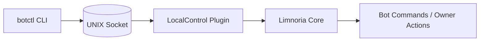

<!-- LocalControl provides a UNIX socket for local command execution. -->

<h1 align="center">LocalControl</h1>

<p align="center">
  <a href="https://github.com/Alcheri/LocalControl/releases/latest">
    
  </a>
<!-- README_HEADER:start -->
  <a href="https://github.com/Alcheri/LocalControl/actions/workflows/tests.yml">
    
  </a>
  <a href="https://github.com/Alcheri/LocalControl/actions/workflows/lint.yml">
    
  </a>
  <a href="https://github.com/Alcheri/LocalControl/security/code-scanning">
    
  </a>
  
  
  
  
</p>
<!-- README_HEADER:end -->

LocalControl is a minimal UNIX-socket control interface for Limnoria bots. It
provides a local administrative command channel without exposing a separate
remote control interface over IRC.

This project includes:

- A Limnoria plugin (`LocalControl`)
- A generic command‑line client (`botctl`)
- Optional wrapper scripts for multi‑bot setups

LocalControl is designed to be self-contained, predictable, and portable across
multiple bot instances.

---

## Installation

Clone the repository into your Limnoria plugin directory, usually
`~/runbot/plugins`:

```bash
cd ~/runbot/plugins
git clone https://github.com/Alcheri/LocalControl.git
```

Load the plugin into your bot:

```text
/msg yourbot load LocalControl
```

The plugin creates this UNIX domain socket beside `plugin.py`:

```text
~/runbot/plugins/LocalControl/.localcontrol.sock
```

If you install the plugin somewhere else, adjust the examples below to match
that path.

---

## Required Hostmask Setup

LocalControl generates a synthetic IRC-style prefix for each local request, for
example:

```text
LocalControl123!local123@localcontrol.invalid
```

To allow this synthetic user to execute owner-level commands, you **must** add a
matching hostmask to your Limnoria user account.

In your Limnoria console (or via IRC as the bot owner):

```text
/msg <bot> user hostmask add <your-account> LocalControl*!local*@localcontrol.invalid
```

Without this step, the bot will reject requests from `botctl` because they will
not map to an authorized owner identity.

---

## CLI Usage

The `botctl` script communicates with the LocalControl socket.

It is located in the plugin directory:

```text
~/runbot/plugins/LocalControl
```

Make it executable if needed:

```bash
chmod +x ~/runbot/plugins/LocalControl/botctl
```

You can then run it directly or add that directory to your `PATH`.

Basic usage:

```bash
botctl bot sysinfo
botctl bot say '#channel' Hello from LocalControl
botctl bot config <name> [<value>]
botctl exec "reload LocalControl"
```

`exec` sends a raw command line. `bot` accepts command tokens directly, which
makes it convenient for bot commands such as `sysinfo` or `say`.

### Architecture Overview

The LocalControl request flow:



### Socket configuration

The CLI resolves the socket path in this order:

1. `--socket` command‑line flag  
2. `BOT_CONTROL_SOCKET` environment variable  
3. Default path:  

```text
~/runbot/plugins/LocalControl/.localcontrol.sock
```

Example:

```bash
botctl --socket /tmp/test.sock bot sysinfo
```

---

## Troubleshooting

### `botctl` is rejected or reports that you are not authorized

This usually means the synthetic LocalControl identity is not mapped to your
owner account.

Verify that your Limnoria account has this hostmask:

```text
LocalControl*!local*@localcontrol.invalid
```

If needed, add it again:

```text
/msg <bot> user hostmask add <your-account> LocalControl*!local*@localcontrol.invalid
```

### `botctl` cannot connect to the socket

Check that the plugin is loaded and that the socket file exists at the expected
path:

```text
~/runbot/plugins/LocalControl/.localcontrol.sock
```

If your installation uses a different location, pass it explicitly:

```bash
botctl --socket /path/to/.localcontrol.sock bot sysinfo
```

You can also set it once with an environment variable:

```bash
export BOT_CONTROL_SOCKET=/path/to/.localcontrol.sock
```

If the socket file is missing entirely, reload the plugin and check the bot log
for bind or startup errors.

### Permission denied when connecting to the socket

The user running `botctl` must be able to access the socket file and its parent
directory.

Make sure:

- The bot is running under the expected local user account.
- You are invoking `botctl` as a user with permission to access that socket.
- The socket directory is not blocked by restrictive filesystem permissions.

If the bot was stopped uncleanly, a stale socket file can also cause problems.
Reloading the plugin normally removes and recreates the socket.

### The `botctl` command is not found

Run it from the plugin directory or call it with its full path:

```bash
~/runbot/plugins/LocalControl/botctl bot sysinfo
```

If you want to call it as `botctl` from anywhere, either add the directory to
your `PATH` or place a wrapper script on your `PATH`.

### Controlling request logging

LocalControl logs one line per socket request by default. To disable or enable
this, use the `socketRequestLogging` plugin configuration option:

Check the current setting:

```bash
botctl bot config plugins.LocalControl.socketRequestLogging
```

Disable logging:

```bash
botctl bot config plugins.LocalControl.socketRequestLogging false
```

Re-enable logging:

```bash
botctl bot config plugins.LocalControl.socketRequestLogging true
```

When enabled, each request is logged with its request ID, command, reply count,
execution time in milliseconds, and any errors.

---

## Multi‑bot wrappers (optional)

If you run multiple bots, wrapper scripts can save you from repeatedly passing
different socket paths.

### pussctl

```bash
#!/usr/bin/env bash
BOT_CONTROL_SOCKET="$HOME/runbot/plugins/LocalControl/.localcontrol.sock" botctl "$@"
```

Place the wrapper somewhere on your `PATH`, make it executable, and use it just
like `botctl`.
<br><br>

<p align="center">Copyright © MMXXVI, Barry Suridge</p>
