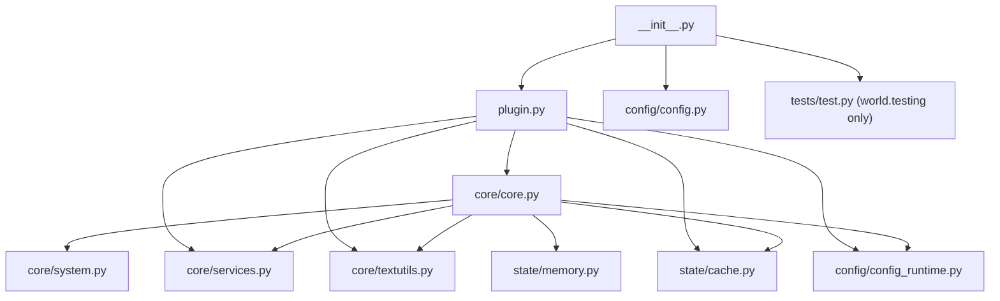
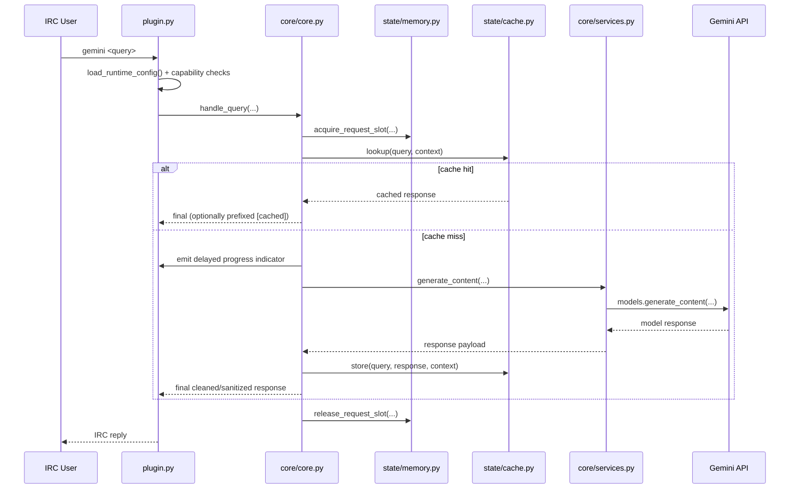

# Geminoria Architecture (Phase 2)

## Layout

```text
Geminoria/
├── plugin.py                    # Limnoria entrypoint (thin facade)
├── __init__.py                  # Plugin bootstrap + Limnoria integration
│
├── core/
│   ├── core.py                  # Main orchestration and tool loop
│   ├── system.py                # System prompt + Gemini tool declarations
│   ├── services.py              # Gemini service adapter (async thread loop)
│   ├── textutils.py             # Sanitizing, redaction, progress helpers
│   └── __init__.py
│
├── state/
│   ├── memory.py                # In-memory buffers + request slot controls
│   ├── cache.py                 # SQLite cache + similarity helpers
│   └── __init__.py
│
├── config/
│   ├── config.py                # Limnoria registry declarations
│   ├── config_runtime.py        # Runtime config dataclass + loader
│   └── __init__.py
│
└── tests/
    ├── test.py                  # Plugin smoke + utility behavior checks
    ├── test_architecture.py     # Architecture and import contract checks
    └── __init__.py
```

## Dependency Flow



## Runtime Request Flow



## Module Responsibilities

- `plugin.py`: command handlers (`gemini`, `gemversion`, `gemcache`) and minimal wiring.
- `core/core.py`: query lifecycle, capability enforcement, tool invocation, caching integration.
- `core/system.py`: tool schemas and system instruction constants.
- `core/services.py`: Gemini client creation and async execution boundary.
- `state/memory.py`: channel history and per-user/per-channel throttling state.
- `state/cache.py`: persistent response cache and fuzzy matching.
- `config/config.py`: persistent Limnoria registry settings declaration.
- `config/config_runtime.py`: converts registry values into typed runtime config.

## Architecture Rules (Enforced)

- Canonical imports must use package paths (`core.*`, `state.*`, `config.*`).
- Legacy flat module paths (for example `Geminoria.cache`) are removed in Phase 2.
- `plugin.py` stays thin; orchestration logic belongs in `core/core.py`.
- Architecture validation lives in `tests/test_architecture.py`.
