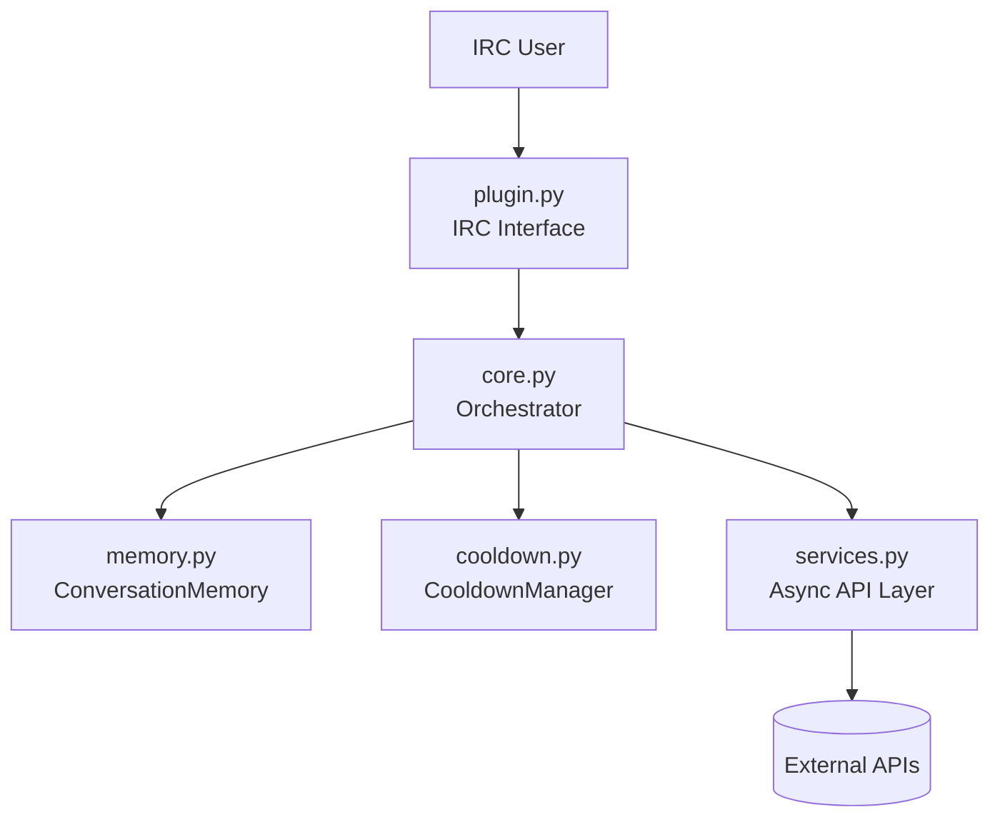
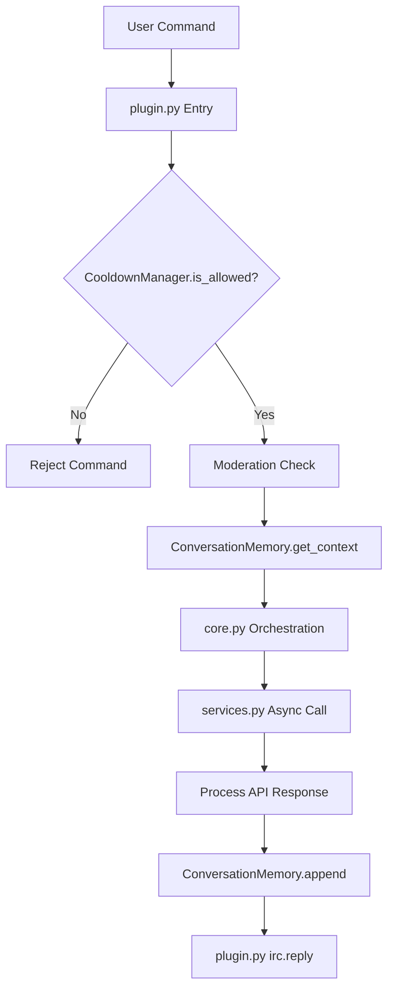
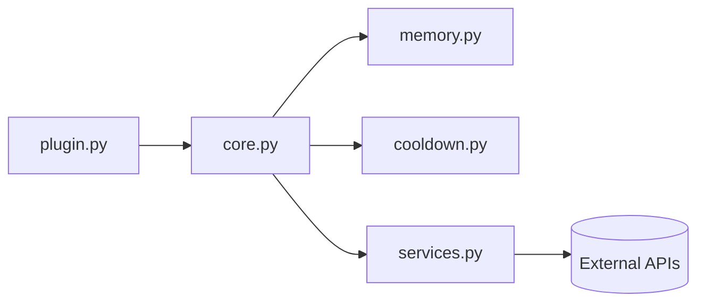
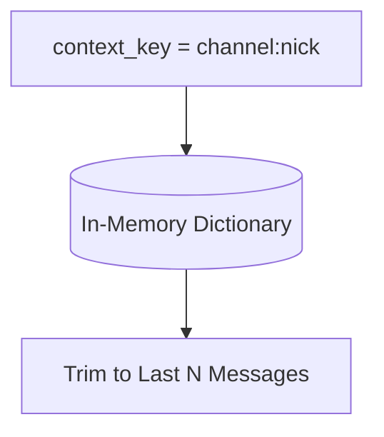
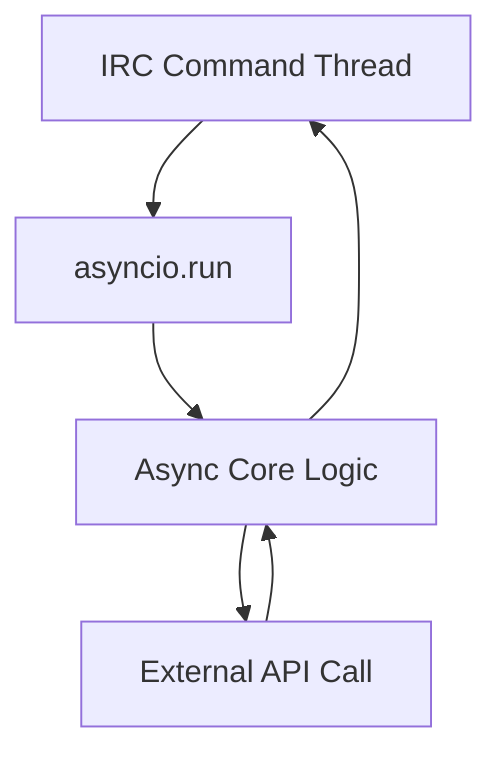
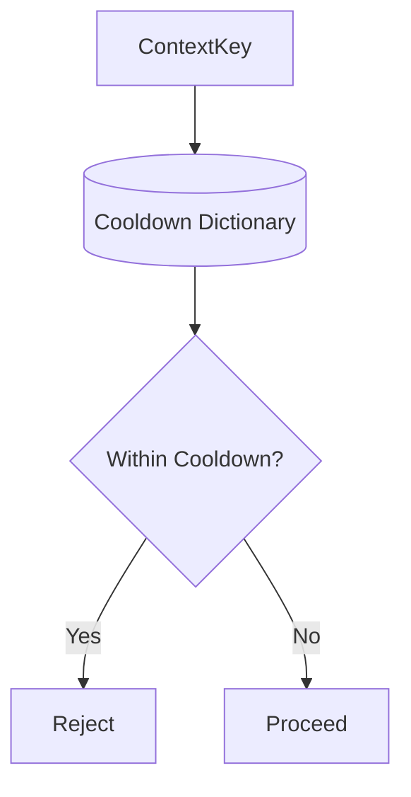

# 🧭 Asyncio Limnoria Plugin – Architecture Overview

This document provides a visual overview of the Asyncio plugin architecture.

It complements `DEVELOPER_NOTES.md` and defines structural boundaries.

All diagrams represent v1.2 architecture intent.

---

# 1️⃣ High-Level System Overview

`Core` --> `Plugin`\
`Plugin` --> `IRC`

* `plugin.py` is the ONLY layer allowed to interact with IRC.
* `core.py` orchestrates but does not directly perform I/O.
* `services.py` performs async network operations only.
* `memory.py` handles context state only.
* `cooldown.py` handles rate limiting only.

# 2️⃣ Request Lifecycle

Guarantees

* Cooldown is enforced BEFORE any API call.
* Moderation occurs before memory mutation.
* Services never communicate with IRC.
* Memory mutation occurs only after successful processing.
* Only `plugin.py` replies to IRC.

# 3️⃣ Layer Boundary Contract

Forbidden Directions

* `services.py` → `plugin.py`
* `memory.py` → `services.py`
* `cooldown.py` → `services.py`
* Any layer directly accessing IRC except `plugin.py`

These restrictions prevent architectural drift.

# 4️⃣ Conversation Memory Model

Properties

* Context isolation per channel and user
* No shared global conversation history
* Automatic trimming
* No persistent storage (v1.1 baseline)
* Persistence is optional and must not block execution.

# 5️⃣ Async Execution Model

Design Characteristics

* threaded = True in Limnoria
* Each command gets a fresh event loop
* No coroutine reuse
* No direct integration with Limnoria's event loop
* Async boundaries are contained within command scope

This model prioritises reliability over theoretical efficiency.

# 6️⃣ Cooldown Model

Guarantees

* Per-user per-channel isolation
* Checked before moderation and API calls
* Prevents runaway API usage

# Architectural Stability Notes #

The following invariants must remain true:

* No global shared history
* No direct event loop integration
* No blocking I/O inside command handlers
* No cross-layer IRC calls
* All registry values converted to native Python types
* Memory and cooldown state encapsulated

If a change violates any diagram above, it must be reconsidered.

Maintained by: Barry Suridge
Plugin: Asyncio for Limnoria IRC
Architecture Target: v1.2 Structural Hardening
